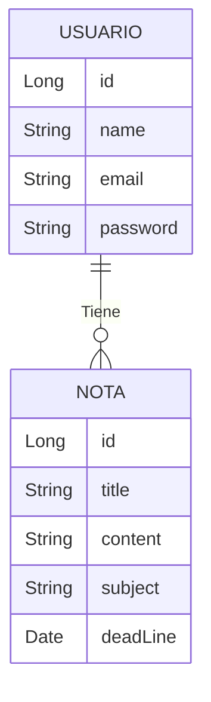
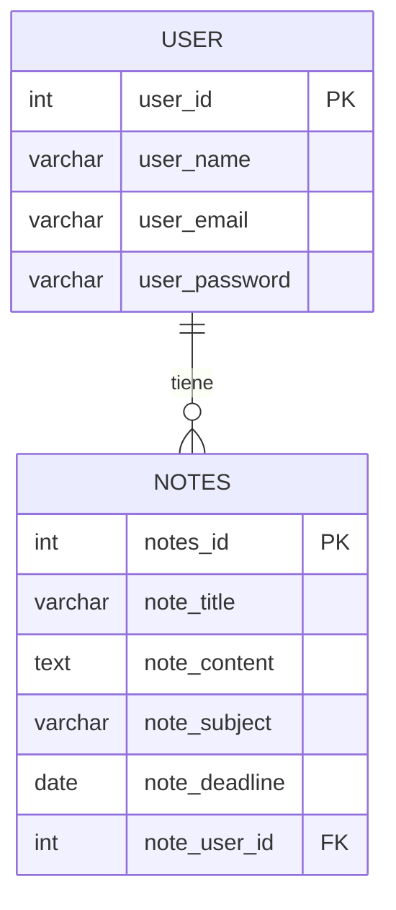

# App_Notes

API REST para gestionar notas académicas con autenticación de usuarios. Cada usuario puede crear, editar, eliminar y consultar sus propias notas, organizadas por materia y con fecha límite para saber qué tiene pendiente por entregar.

**Características principales:**
- Registro e inicio de sesión con autenticación JWT
- CRUD completo de notas personales
- Notas ordenadas por fecha límite más próxima
- Cada usuario solo puede acceder a sus propios datos

## Tecnologías

- Java 17
- Spring Boot (Web, Security, Data JPA)
- MySQL
- Maven

## Diagrama de clases

Un Usuario puede tener muchas Notas (1 a N). Cada Nota pertenece a un único Usuario.

## Diagrama E-R

